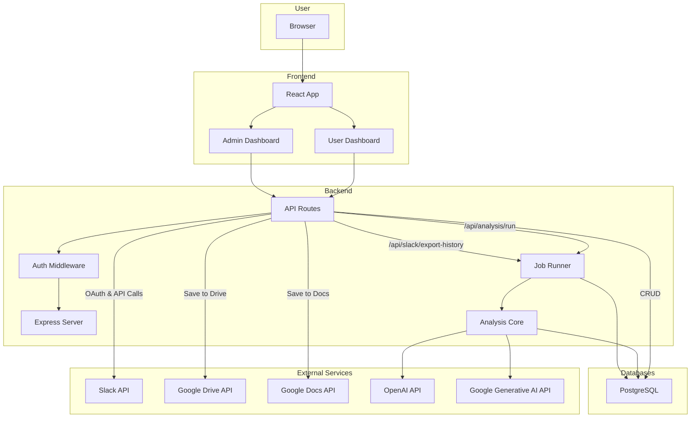
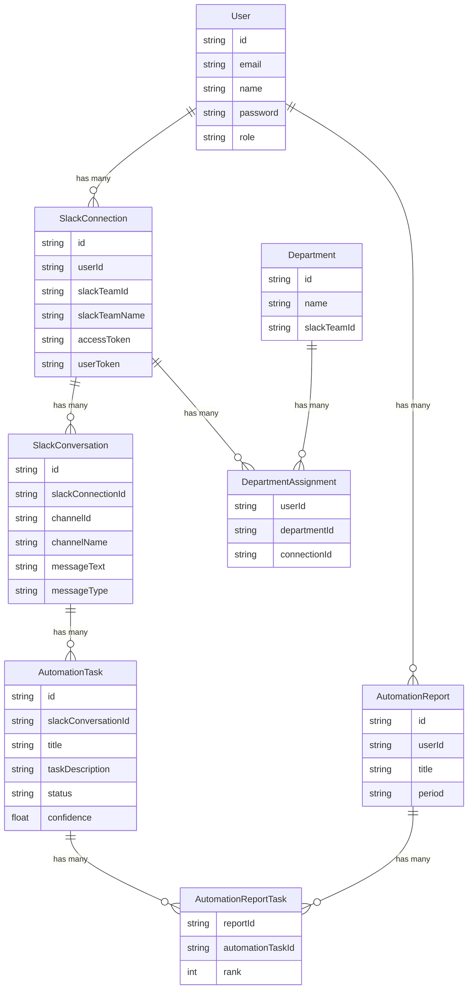

# Slack Automation Discovery

This project is a full-stack application designed to help organizations analyze their Slack conversations to discover opportunities for automation. It allows users to connect their Slack workspaces, select channels and DMs for analysis, and then scrapes the conversation history to identify repetitive tasks and workflows that could be automated. The application also provides a dashboard to visualize the findings and manage the data collection process.

## Key Features

- **AI-Powered Conversation Analysis:** Leverages OpenAI and Google Generative AI to analyze Slack conversations and identify potential automation opportunities.
- **Secure Slack Integration:** Uses Slack's OAuth v2 for secure and seamless integration with Slack workspaces.
- **Asynchronous Data Scraping:** A robust background job system scrapes conversation history from selected channels and DMs without blocking the user interface.
- **Advanced Rate Limiting:** A sophisticated, custom-built rate limiter to manage Slack API calls efficiently and avoid rate-limiting errors.
- **Google Drive & Docs Integration:** Automatically saves scraped conversations and analysis reports to Google Drive and Google Docs for easy access and collaboration.
- **Role-Based Access Control:** Separate, feature-rich interfaces for both regular users and administrators.
- **Comprehensive Admin Dashboard:** A powerful dashboard for admins to monitor system statistics, manage users, and control the entire data collection and analysis process.
- **Data-Driven Reporting:** Generate and export detailed reports on automation opportunities in both JSON and CSV formats.
- **Organizational Chart Visualization:** Visualize your organization's structure to better understand communication patterns and workflows.

## Architecture

The application is composed of two main parts: a React frontend and a Node.js backend.

### Architecture Diagram



## Technologies Used

### Backend

- **Node.js:** A JavaScript runtime for building the server-side application.
- **Express:** A fast, unopinionated, minimalist web framework for Node.js.
- **PostgreSQL:** A powerful, open-source object-relational database system.
- **Prisma:** A next-generation ORM for Node.js and TypeScript.
- **JSON Web Tokens (JWT):** Used for creating access tokens for authentication.
- **Axios:** A promise-based HTTP client for making requests to external APIs.
- **OpenAI & Google Generative AI:** Libraries for interacting with the respective AI models.

### Frontend

- **React:** A JavaScript library for building user interfaces.
- **Vite:** A fast build tool that provides a lightning-fast development experience.
- **Material-UI:** A popular React UI framework for building beautiful and responsive user interfaces.
- **React Query:** A library for fetching, caching, and updating data in React applications.
- **React Router:** A standard library for routing in React.
- **Axios:** Used for making API requests to the backend.
- **@xyflow/react:** A library for building interactive node-based editors and diagrams.

### Backend

The backend is a Node.js application built with the Express framework. It uses a PostgreSQL database with the Prisma ORM to store all its data.

**Key features of the backend include:**

- **RESTful API:** A comprehensive API for handling authentication, data scraping, analysis, and reporting.
- **Authentication:** A robust authentication system using JSON Web Tokens (JWT) to secure the API endpoints.
- **Slack Integration:** A deep integration with the Slack API to handle OAuth, fetch channel and user data, and scrape conversation histories.
- **Asynchronous Job Processing:** A sophisticated job processing system to handle the long-running task of scraping Slack conversations in the background.
- **Rate Limiting:** A custom rate limiter to ensure that the application does not exceed the Slack API rate limits.
- **Google Drive/Docs Integration:** The ability to save scraped conversations to Google Docs for easy viewing and sharing.
- **AI-Powered Analysis:** The backend is equipped with libraries for OpenAI and Google's Generative AI, suggesting that it can perform intelligent analysis on the scraped data to identify automation opportunities.

### Frontend

The frontend is a modern React application built with Vite. It uses Material-UI for its components and `react-query` for managing server state.

**Key features of the frontend include:**

- **User and Admin Roles:** The application has separate interfaces for regular users and administrators.
- **User Dashboard:** A simple dashboard for users to connect their Slack workspaces and view the status of their data collection.
- **Admin Dashboard:** A powerful dashboard for administrators to monitor the entire system, manage users, and control the data scraping process.
- **Data Visualization:** The application uses charts and graphs to visualize the collected data and analysis results, making it easy to identify trends and opportunities.
- **Organization Visualization:** The application can visualize the organization's structure, which can be used to understand communication patterns and workflows.

## Project Structure

The project is organized into two main directories: `frontend` and `backend`.

```
/
├── backend/
│   ├── analysis-runner/    # Contains the core logic for running AI analysis
│   ├── job-runner/         # A separate service for processing background jobs
│   ├── prisma/             # Database schema and migrations
│   ├── routes/             # API route handlers
│   ├── server.js           # Main entry point for the backend server
│   └── package.json
│
├── frontend/
│   ├── src/
│   │   ├── components/     # React components, organized by feature
│   │   ├── contexts/       # React context providers for global state
│   │   ├── App.jsx         # Main application component with routing
│   │   └── main.jsx        # Entry point for the React application
│   └── package.json
│
└── README.md
```

## Database Schema

The database schema is defined in `backend/prisma/schema.prisma`. Here is an ERD diagram showing the most important tables and their relationships:



## Functionality

### User Functionality

- **Connect Slack Workspace:** Users can securely connect their Slack workspace to the application using the Slack OAuth flow.
- **Select Channels and DMs:** Users can select which public channels, private channels, and direct messages they want to be analyzed.
- **View Dashboard:** Users can view a simple dashboard that shows the status of their data collection.

### Admin Functionality

- **System-wide Monitoring:** Admins have access to a comprehensive dashboard that shows statistics for the entire system, including the number of connected workspaces, scraped messages, and identified automation opportunities.
- **User Management:** Admins can view a list of all users, their connected workspaces, and their selected channels.
- **Data Scraping Control:** Admins can manually trigger the data scraping process for any user and channel. They can also enable or disable daily scraping for specific channels.
- **View Analysis Results:** Admins can view the results of the AI-powered analysis, which highlights potential automation opportunities.
- **Reporting:** Admins can generate reports based on the collected data.

## Getting Started

To get the application running locally, you will need to set up both the backend and the frontend.

### Prerequisites

- Node.js and npm
- PostgreSQL
- A Slack application with API credentials
- A Google Cloud project with the Drive and Docs APIs enabled and credentials

### Backend Setup

1.  Navigate to the `backend` directory.
2.  Install the dependencies: `npm install`
3.  Create a `.env` file and populate it with the necessary environment variables (see `backend/.env.example` for a template).
4.  Run the database migrations: `npx prisma migrate dev`
5.  Start the backend server: `npm run dev`

### Frontend Setup

1.  Navigate to the `frontend` directory.
2.  Install the dependencies: `npm install`
3.  Create a `.env` file and populate it with the necessary environment variables (see `frontend/.env.example` for a template).
4.  Start the frontend development server: `npm run dev`

The application should now be running on `http://localhost:3000`.

## Contributing

Contributions are welcome! Please feel free to submit a pull request or open an issue if you find a bug or have a suggestion for a new feature. 